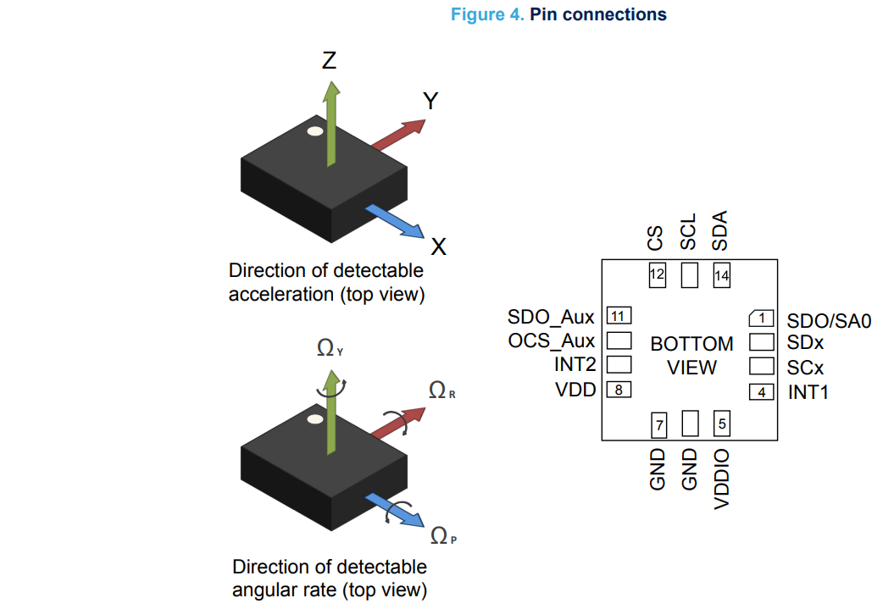
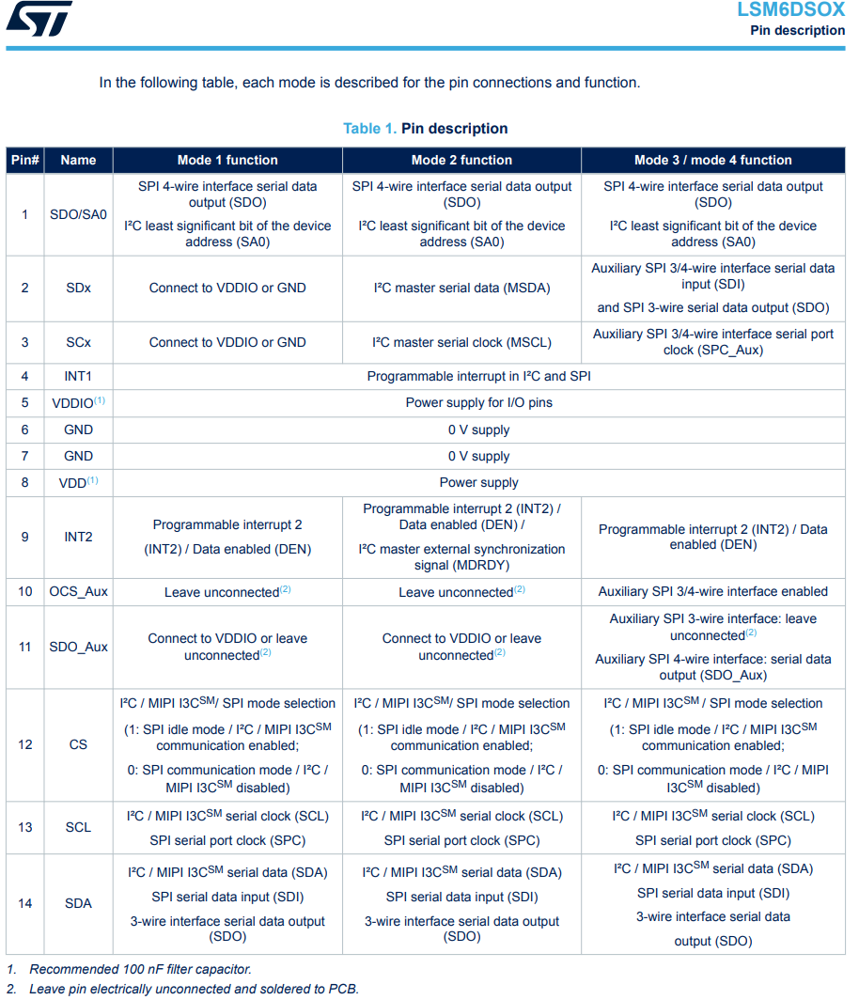
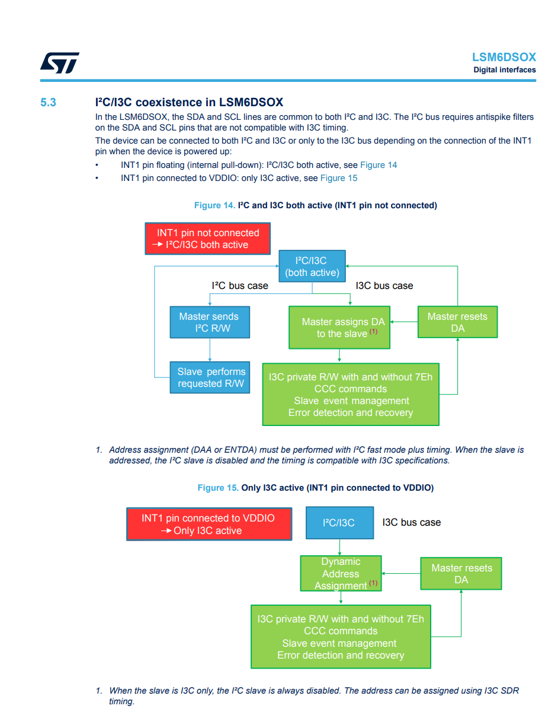
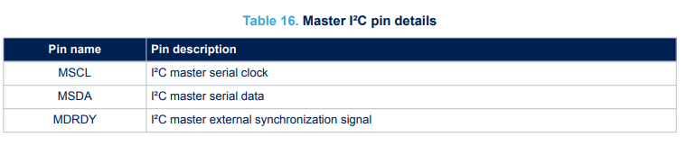
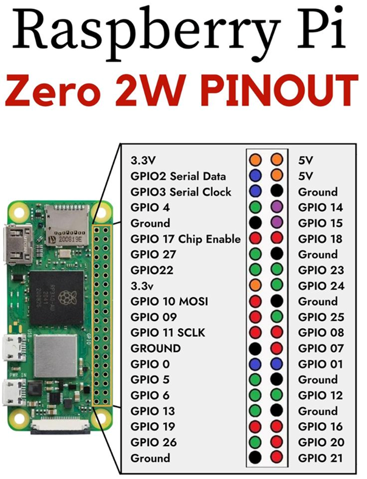
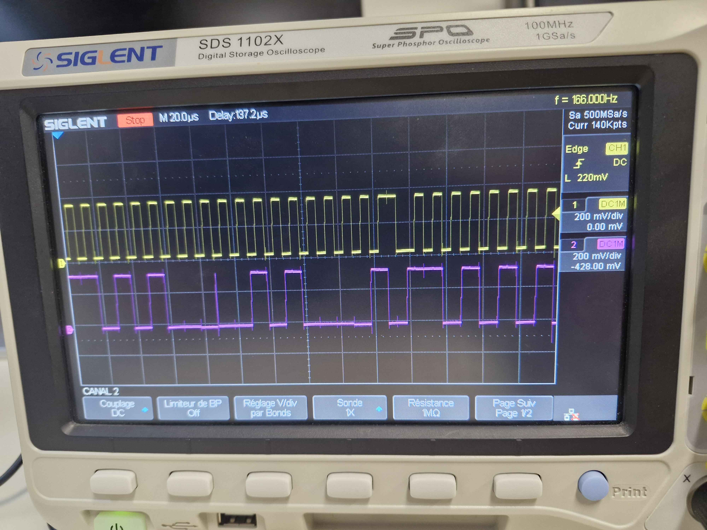

# Driver-LSM6DSOX
LSM6DSOX - Datasheet de STM Electronics

[Datasheet LSM6DSOX](https://www.st.com/resource/en/datasheet/lsm6dsox.pdf)

1. __What is the LSM6DSOX component ?__

" The LSM6DSOX is a 6-axis IMU (inertial measurement unit) system-in-package
featuring a 3-axis digital accelerometer and a 3-axis digital gyroscope, boosting
performance at 0.55 mA in high-performance mode and enabling always-on lowpower features for an optimal motion experience for the consumer.

The LSM6DSOX supports the main OS requirements, offering real, virtual, and batch sensors with 9 KB for
dynamic data batching. [...] The LSM6DSOX has a full-scale __acceleration range of ±2/±4/±8/±16 g and an angular rate range of
±125/±250/±500/±1000/±2000 dps__ "

" The LSM6DSOX works as a combo accelerometer-gyroscope sensor, generating acceleration and angular rate
output data. It is also possible to connect an external sensor (magnetometer) by using the sensor hub feature
(mode 2). These data can be used as the input of up to 16 programs in the embedded finite state machine
All 16 finite state machines are independent: each one has its dedicated memory area and it is independently
executed. An interrupt is generated when the end state is reached or when some specific command is performed."

1. __Description of the PIN__

2. __Communication protocol I²C__

"The registers embedded inside the LSM6DSOX may be accessed through both the I²C and SPI serial interfaces.
The latter may be software configured to operate either in 3-wire or 4-wire interface mode. The device is
compatible with SPI modes 0 and 3.
The serial interfaces are mapped onto the same pins. To select/exploit the I²C interface, the CS line must be tied
high (that is, connected to VDDIO)."

"If the LSM6DSOX is configured in mode 2, a master I²C line is available. The master serial interface is mapped to
the following dedicated pins."

3. __Raspberry pi zero 2 w pin use__

We use the following pins for the I²C communication with the LSM6DSOX:
- Pin 1: 3.3V Power
- Pin 3: SDA (I²C Data)
- Pin 5: SCL (I²C Clock)
- Pin 6: Ground

4. __I²C Visualization__

 We can see on the oscilloscope the I²C communication between the Raspberry Pi and the LSM6DSOX.
- Yellow: SCL
- Purple: SDA 